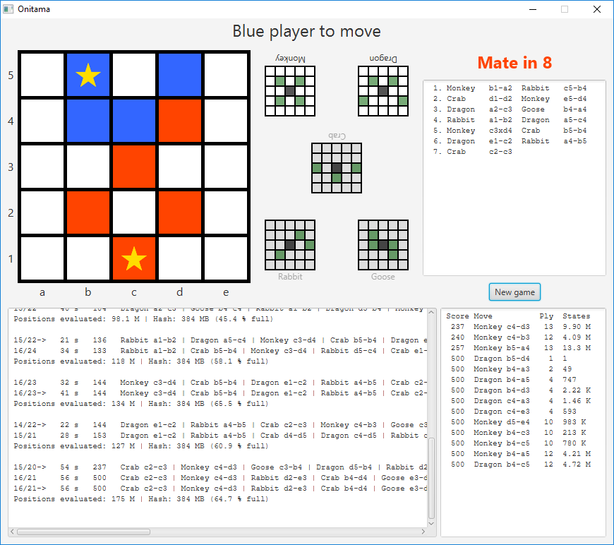
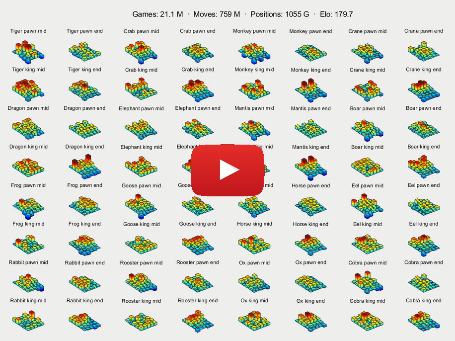

# Onitama

AI for the board game [Onitama](http://www.arcanewonders.com/game/onitama/). Read the
[rules of the game here](http://www.arcanewonders.com/resources/Onitama_Rulebook.PDF).

The AI uses a negamax search with alpha-beta pruning and several other techniques to limit the
search space. Below is a photo of the actual game, and a screenshot of the AI at play (click for higher
resolution):

<a href="http://www.arcanewonders.com/wp-content/uploads/2017/06/onitama-1.png">
  
</a>
<span style="display:inline-block;width:5%;"></span>
<a href="screenshot-gui.png">
  
</a>

## Running

```
gradle run
```

Requires Java 11. Uses JavaFX for the GUI.

## Features implemented
- [Negamax](https://chessprogramming.wikispaces.com/Negamax) with [alpha-beta pruning](https://chessprogramming.wikispaces.com/Alpha-Beta)
- [Iterative deepening](https://chessprogramming.wikispaces.com/Iterative+Deepening)
- [Principal variation search](https://chessprogramming.wikispaces.com/Principal%20Variation%20Search)
- [Quiescence search](https://chessprogramming.wikispaces.com/Quiescence%20Search)
- Dynamically sized, two-tier, [transposition table](https://chessprogramming.wikispaces.com/Transposition+Table) ("TT")
- [Zobrist hashing](https://chessprogramming.wikispaces.com/Zobrist+Hashing)
- [Move ordering](https://chessprogramming.wikispaces.com/Move+Ordering): best move, winning moves, capture moves, [history heuristics](https://chessprogramming.wikispaces.com/History%20Heuristic)
- [Evaluation function](https://chessprogramming.wikispaces.com/Evaluation) optimized by [SPSA automated tuning](https://chessprogramming.wikispaces.com/SPSA)
- [Bitboards](https://chessprogramming.wikispaces.com/Bitboards), for move generation and validation
- Multithreaded [pondering](https://chessprogramming.wikispaces.com/Pondering)

## Performance

On a 2.6 GHz laptop, the AI evaluates around 4 million board states (i.e. moves) per second.
As for how many moves ahead the AI can search, it varies greatly with the
state of the game. From the initial board position, and still on a 2.6 GHz laptop with a single-threaded
search, the AI typically searches a nominal depth of 12
[plies](https://chessprogramming.wikispaces.com/Ply) fully in around 1 second, and 16-17 plies in
1 minute. During the endgame, with 2 pieces per player, the AI commonly searches around 16
plies in 1 second, and >30 plies in 1 minute.
The branching factor (moves tried per state) also varies with the state of the game,
but tends to be between 2 and 3 on average.

Thanks to its two-tier property, the transposition table (TT) performs quite well even when filling up.
As long as the fill rate is less then around 90 %, search times are fairly constant.
Fill rates of 20 - 60 % often result in fastest search times. Even though the number of visited
states could be slightly reduced by increasing the size of the TT, keeping it smaller leads to better cache locality.

## Sample analysis

Below is some output from a game where the AI, after a single move from a human player, was able
to guarantee a win in 18+ plies (9+ moves), after 39 seconds of computation on a
2.6 GHz laptop. Depth "18/24" means that the game was searched in full to a depth of 18 plies,
and that the maximum depth analyzed (including quiescence search) was 24 plies. Due to hits in the
transposition table, the move series is often cut off, meaning that we are not necessarily seeing
the full series that lead to the win, hence 18+ plies.
A score of ~100 means one piece advantage. 500 means victory. Smaller difference in scores means
better positioning on the board. The output format is inspired by
[Crafty](http://www.craftychess.com/documentation/craftydoc.html).

```
Player 1 cards: Crane Rooster
Player 2 cards: Tiger Ox
Extra card: Horse

Enter player move 1: Rooster c1d2

  +---+---+---+---+---+
5 | b | b | B | b | b |
  +---+---+---+---+---+
4 |   |   |   |   |   |
  +---+---+---+---+---+
3 |   |   |   |   |   |
  +---+---+---+---+---+
2 |   |   |   | R |   |
  +---+---+---+---+---+
1 | r | r |   | r | r |
  +---+---+---+---+---+
    a   b   c   d   e

Player 1 cards: Crane Horse
Player 2 cards: Tiger Ox
Extra card: Rooster

 depth    time  score  best moves
 1/ 2->   0.00    38   Tiger a5-a3
 2/ 3->   0.01    19   Tiger a5-a3 | Crane d2-c1
 3/ 6->   0.01    29   Ox a5-a4 | Crane d2-c1 | Rooster e5-d4
 4/ 7->   0.01    25   Ox d5-d4 | Crane d2-d3 | Rooster e5-d5 | Ox d3-e3
 5/ 8->   0.02    40   Ox d5-d4 | Crane d2-d3 | Tiger a5-a3 | Ox d3-e3 | Crane e5-e4
 6/11->   0.02    24   Ox d5-d4 | Crane d2-d3 | Tiger a5-a3 | Horse d3-d2 | Crane a3-b4 | Tiger d1-d3
 7/11->   0.04    42   Ox d5-d4 | Crane d2-d3 | Tiger a5-a3 | Ox d3-d2 | Crane a3-b4 | Tiger d1-d3 | Ox e5-e4 | Crane d3-d4 | Rooster e4-d4
 8/14->   0.10    40   Ox d5-d4 | Horse d2-c2 | Rooster d4-c3 | Ox c2-d2 | Horse e5-e4 | Crane b1-b2 | Ox e4-d4 | Rooster d2-e3
 9/14->   0.15    54   Ox d5-d4 | Horse d2-c2 | Rooster d4-c3 | Ox c2-d2 | Horse e5-e4 | Crane b1-b2 | Ox e4-d4 | Rooster d2-e3 | Crane b5-b4
10/17->   0.41    47   Ox d5-d4 | Horse d2-c2 | Rooster d4-c3 | Ox c2-d2 | Horse e5-e4 | Crane a1-a2 | Ox e4-d4 | Rooster d2-e3 | Crane d4-d3 | Horse e3-e2
11/17->   0.58    48   Ox d5-d4 | Horse d2-c2 | Rooster d4-c3 | Ox c2-d2 | Horse e5-e4 | Crane b1-b2 | Ox e4-d4 | Rooster d2-e2 | Crane b5-b4 | Ox b2-c2 | Rooster d4-c4 | Crane c2-c3 | Ox c4-c3
12/19->   1.25   121   Ox d5-d4 | Horse d2-c2 | Rooster d4-c3 | Ox c2-d2 | Horse e5-e4 | Crane b1-b2 | Ox c5-c4 | Horse b2-b3 | Tiger b5-b3 | Ox a1-a2 | Horse a5-a4 | Rooster a2-b3
13/18     1.50   130   Ox d5-d4 | Horse d2-c2 | Rooster d4-c3 | Ox c2-d2 | Horse e5-e4 | Crane b1-b2 | Ox c5-c4 | Horse b2-b3 | Tiger b5-b3 | Ox a1-a2 | Horse b3-b4 | Tiger d1-d3 | Ox e4-d4 | Horse d3-d4 | Crane c3-d4
13/18->   2.16   130   Ox d5-d4 | Horse d2-c2 | Rooster d4-c3 | Ox c2-d2 | Horse e5-e4 | Crane b1-b2 | Ox c5-c4 | Horse b2-b3 | Tiger b5-b3 | Ox a1-a2 | Horse b3-b4 | Tiger d1-d3 | Ox e4-d4 | Horse d3-d4 | Crane c3-d4
14/20     2.94   134   Ox d5-d4 | Horse d2-c2 | Rooster d4-c3 | Ox c2-d2 | Horse e5-e4 | Crane b1-b2 | Ox c5-c4 | Horse b2-b3 | Tiger b5-b3 | Rooster d2-e2 | Crane c4-d5 | Tiger e1-e3 | Horse d5-d4 | Crane e3-e4 | Rooster d4-e4
14/20->   4.94   134   Ox d5-d4 | Horse d2-c2 | Rooster d4-c3 | Ox c2-d2 | Horse e5-e4 | Crane b1-b2 | Ox c5-c4 | Horse b2-b3 | Tiger b5-b3 | Rooster d2-e2 | Crane c4-d5 | Tiger e1-e3 | Horse d5-d4 | Crane e3-e4 | Rooster d4-e4
15/20     6.05   142   Ox d5-d4 | Horse d2-c2 | Rooster d4-c3 | Ox c2-d2 | Horse e5-e4 | Crane b1-b2 | Ox c5-c4 | Horse b2-b3 | Tiger b5-b3 | Ox d2-e2 | Crane e4-d5 | Rooster a1-b1 | Ox a5-a4 | Tiger b1-b3 | Rooster c4-b3
15/20->   8.78   142   Ox d5-d4 | Horse d2-c2 | Rooster d4-c3 | Ox c2-d2 | Horse e5-e4 | Crane b1-b2 | Ox c5-c4 | Horse b2-b3 | Tiger b5-b3 | Ox d2-e2 | Crane e4-d5 | Rooster a1-b1 | Ox a5-a4 | Tiger b1-b3 | Rooster c4-b3
16/23     13 s   145   Ox d5-d4 | Horse d2-c2 | Rooster d4-c3 | Ox c2-d2 | Horse e5-e4 | Crane b1-b2 | Ox c5-c4 | Horse b2-b3 | Tiger b5-b3 | Ox a1-b1 | Crane b3-b2 | Rooster d2-e2 | Ox b2-b1 | Tiger e2-e4 | Rooster a5-b5 | Crane e1-e2
16/23->   22 s   145   Ox d5-d4 | Horse d2-c2 | Rooster d4-c3 | Ox c2-d2 | Horse e5-e4 | Crane b1-b2 | Ox c5-c4 | Horse b2-b3 | Tiger b5-b3 | Ox a1-b1 | Crane b3-b2 | Rooster d2-e2 | Ox b2-b1 | Tiger e2-e4 | Rooster a5-b5 | Crane e1-e2
17/22     27 s   150   Ox d5-d4 | Horse d2-c2 | Rooster d4-c3 | Ox c2-d2 | Horse e5-e4 | Crane b1-b2 | Ox c5-c4 | Horse b2-b3 | Tiger b5-b3 | Ox a1-b1 | Horse b3-b2 | Rooster d2-e2 | Ox b2-b1 | Tiger e2-e4 | Rooster a5-b5 | Ox e1-e2 | Crane b5-b4
17/23->   38 s   150   Ox d5-d4 | Horse d2-c2 | Rooster d4-c3 | Ox c2-d2 | Horse e5-e4 | Crane b1-b2 | Ox c5-c4 | Horse b2-b3 | Tiger b5-b3 | Ox a1-b1 | Horse b3-b2 | Rooster d2-e2 | Ox b2-b1 | Tiger e2-e4 | Rooster a5-b5 | Ox e1-e2 | Crane b5-b4
18/24     39 s   500   Ox d5-d4 | Horse d2-c2 | Rooster d4-c3 | Ox c2-d2 | Horse e5-e4 | Crane b1-b2 | Ox e4-d4 | Rooster d2-e3 | Crane d4-d3 | Horse e3-e2 | Rooster c3-d4 | Crane b2-c1 | Horse c5-c4 | Rooster a1-b2 | Crane a5-a4 | Horse b2-b3 | Rooster d4-e4 | Crane d1-d2
18/24->   39 s   500   Ox d5-d4 | Horse d2-c2 | Rooster d4-c3 | Ox c2-d2 | Horse e5-e4 | Crane b1-b2 | Ox e4-d4 | Rooster d2-e3 | Crane d4-d3 | Horse e3-e2 | Rooster c3-d4 | Crane b2-c1 | Horse c5-c4 | Rooster a1-b2 | Crane a5-a4 | Horse b2-b3 | Rooster d4-e4 | Crane d1-d2

Nominal depth searched: 18
Max depth searched: 24

States evaluated: 147421142
Quiescence states evaluated: 11463899
Leaves evaluated: 88328487

TT size: 67108864 entries (768 MB)
TT fill rate: 38.66 %
TT hit rate: 34.87 % (21176805 / 60730275) -- 1: 0.00%  2: 1.83%  3: 46.28%  4: 21.09%  5: 15.37%  6: 18.04%  7: 5.32%  8: 28.80%  9: 8.18%  10: 34.97%  11: 10.58%  12: 38.83%  13: 13.10%  14: 40.78%  15: 17.39%  16: 39.72%  17: 23.51%  18: 30.73%
Best move hit rate: 29.68 % (16025325 / 53999535) -- 1: 94.44%  2: 93.33%  3: 75.97%  4: 85.52%  5: 67.49%  6: 85.76%  7: 70.75%  8: 84.01%  9: 67.89%  10: 80.43%  11: 63.96%  12: 73.42%  13: 53.01%  14: 60.94%  15: 33.82%  16: 31.97%  17: 0.07%  18: 7.26%

Branching factor: 2.73 -- 1: 9.50  2: 2.39  3: 9.28  4: 1.42  5: 8.72  6: 1.17  7: 9.71  8: 1.11  9: 9.43  10: 1.11  11: 8.80  12: 1.13  13: 7.60  14: 1.17  15: 6.08  16: 1.24  17: 3.08  18: 0.84
Quiescence branching factor:  19: 0.81  20: 0.45  21: 0.50  22: 0.27  23: 0.27  24: 0.00
```

## Details on features implemented/tried

### Transposition table ([wiki](https://chessprogramming.wikispaces.com/Transposition+Table))
Also known as TT. A table that stores states that have been evaluated previously during the search, so that they don't have to be evaluated again.
Uses [Zobrist hashing](https://chessprogramming.wikispaces.com/Zobrist+Hashing) to encode states.
By itself this improved search times by around 25 %, using a replace-always scheme. Moreover, it makes it possible to store the
best move for each node. Changing this to a depth-preferred scheme gave much better results when the TT was filling up (>25 % full), but sometimes
resulted in worse results. Using a two-tier table, storing one depth-preferred entry and one most recent entry, gave the best result. Huge improvements
were seen for searches where the TT was filling up. However, for situations where the TT is sparsely populated, such as fast game play with a large TT,
this does not matter much. An example search from the initial board state with a 29 bit (6 GB) TT searched 22 plies in 179 minutes and 38.8 billion
states with a replace-always scheme, and in 32 minutes and 6.45 billion states with the two-tier scheme (>90 % populated TT).

##### Composition
Each entry in the TT uses 96 bits (12 bytes), organized like this:

|Bits|Size|Purpose|Range|
|----|----|-------|-----|
|0 - 63|64 bits|Zobrist key (board and card state)|64 bits|
|64 - 65|2 bits|Bound type|0 = exact score, 1 = lower bound, 2 = lower bound|
|66 - 71|6 bits|Depth|0 - 63|
|72 - 81|10 bits|Score|-512 - 511|
|82 - 86|5 bits|Best move, origin cell|0 - 24|
|87|1 bit|Best move, card used|0 = lower card played, 1 = higher card played|
|88 - 92|5 bits|Best move, destination cell|0 - 24|
|93 - 95|3 bits|Unused|-|

It should be possible to save some space by combining the Zobrist key and the TT index. For example, if a 24 bit TT is used,
we could use the lower 24 bits of the Zobrist key as the index into the TT, and only store the higher 40 bits in the table.
Moreover, the Zobrist keys might not need to be 64 bits, they could be made shorter, at the cost of an increased risk of
hash collisions. This has not been experimented with.

##### Dynamic resizing
This allows the TT to change size during the search, carrying over all stored entries. Experiments show that this works
quite well (at least with a two-tiered TT); a search with a small TT that is later adjusted to a larger size does not seem to suffer in the
long run from initially having started out small. This is used by the pondering feature, by starting many searches simultaneously with small TTs, and
increasing the size gradually as some searches finish and there are fewer remaining.


### Move ordering ([wiki](https://chessprogramming.wikispaces.com/Move+Ordering))
Thanks to [alpha-beta pruning](https://chessprogramming.wikispaces.com/Alpha-Beta),
trying better moves first during the search
lowers the effective [branching factor](https://chessprogramming.wikispaces.com/Branching+Factor),
meaning an exponential savings in nodes visited (bigger saving the
more plies are searched). At a typical game state, there are 10 - 20 possible moves, yet with efficient move
ordering, we only need to test ~2.5 of those moves on average before a cutoff. To save time, moves are
generated lazily (no need to score and sort 20 moves, if we only need to test 2 of them). The order is as follows:

1. [Best move](https://chessprogramming.wikispaces.com/Best+Move), if available.
   This is the best move found during a more shallow search in
   [iterative deepening](https://chessprogramming.wikispaces.com/Iterative+Deepening) and
   stored in the TT. This by itself resulted in ~5x faster search times over no move ordering at all
   in the `TestVariousBoardsAndCards` test suite.
   (Note: It is ok to put this before winning moves, since the best move will always be the
   winning move, if such exists, thanks to the quiescence search.)
1. Winning moves; capturing the opponent's king, or moving the king to the winning position. This reduced the number
   of visited states by ~20 % in the test suite.
1. Piece captures. This made a huge difference -- 10-20x less states visited overall in the test suite.
1. [History table heuristic](https://chessprogramming.wikispaces.com/History+Heuristic).
   Moves are ordered by how often they produce non-capture, non-winning alpha-beta cutoffs.
   This cut the number of visited nodes in half in the test suite.

##### Two best moves
Tried this, and it did not decrease the number of states visited. If anything it did the opposite. Unclear why. The
implementation seemed to work as intended. Possibly the two best moves tend to be similar to each other (such as grabbing a certain
opponent piece, leading to material difference and a high score), and in the case that the first move fails to produce a cut-off, a more different
move is needed.


### Evaluation function ([wiki](https://chessprogramming.wikispaces.com/Evaluation))
The evaluation function is used at the end of the search, to heuristically assign a score to a given game state (board and cards).
During earlier phases of the AI, an evaluation function that assigned a static, board-symmetrical score to each square was used,
with higher scores assigned closer to the center of a board. This was a highly efficient function, since it could be performed
with a few bit operations and multiplications, and seemed to work reasonably well. Experiments were performed adding
[mobility](https://chessprogramming.wikispaces.com/Mobility) to the equation, but that did not improve the win rate.

##### The need for automated tuning
It was noticed that modifying the scores assigned to each square could have a significant impact on the win rate, suggesting
that there was room for improvement by finding the optimal score for each square. Moreover, there are more factors
that could be considered than just board position: cards assigned, king position, phase of the game (for example, towards
the end of the game, it might be more advantageous to move your king towards the opponent king's start square, which wins
the game, and similarly defend your own start square). Figuring out the importance of all these parameters is hard to do
manually, which is why one turns to [automated tuning](https://chessprogramming.wikispaces.com/Automated+Tuning).

##### Optimization algorithm
There are two parts to automated tuning. One is choosing which parameters to tune, and the other is the optimization
algorithm to figure out the optimal value for each parameter. A few popular algorithms are
[SPSA](https://chessprogramming.wikispaces.com/SPSA),
[Stockfish's tuning method](https://chessprogramming.wikispaces.com/Stockfish%27s%20Tuning%20Method), and
[local optimization](https://chessprogramming.wikispaces.com/Texel%27s%20Tuning%20Method#Pseudo%20Code).
After experimentation with all three, SPSA (Simultaneous Perturbation Stochastic Approximation) was found to converge
fastest. A good explanation of this algorithm can be found in
[this paper](http://www.jhuapl.edu/spsa/PDF-SPSA/Spall_Implementation_of_the_Simultaneous.PDF).

##### Parameters to tune
The tricky part is finding the right set of parameters to tune. On the one hand adding as many parameters as possible
for more granular scores, on the other hand not adding parameters unnecessarily, to keep the dimension count down and
keep the evaluation function computationally cheap. Below are a few parameter sets tested, optimized with SPSA.

|Parameter set|Parameters|Time|Elo (fixed plies)|Elo (fixed time)|
|-------------|:--------:|-----------|-----------------|----------------|
|Square + piece|30|4 hours|+100 (64 % win)|+70 (60 % win)|
|Square + piece + card|440|48 hours|+120 (66.5 % win)|+70 (60 % win)|
|As above, cards individually tuned|440|24 hours|+135 (68.5 % win)|+80 (61.5 % win)|
|Square + piece + card + phase|880|48 hours|+180 (74 % win)|+100 (64 % win)|

The time shows the elapsed time until convergence (using a 4 x 2.6 GHz CPU laptop), and the Elo differences are against the
hand-tuned symmetrical evaluation function. To make the tuning more stable, the AIs search a fixed number of plies.
For actual playing strength, a fixed time per move is most representative. The reason for the difference between the two is
that evaluation functions differ in execution time, and slow evaluation functions can end up using a significant portion
of the total search time. In particular, the evaluation functions based on card possession are difficult to update
during move/unmove, and are thus calculated from scratch on each invocation.

Running the best performing evaluation function (square + piece + card + phase) against the simpler
30 parameter square + piece function, with a fixed time per move, the performance gain was 60 Elo (58.5 % win rate).

##### Conclusion
The parameter set that showed most promise was using one score for each combination of board position, card,
piece type (pawn / king), and game phase (middle / end game). For a horizontally self-symmetrical card, we need 15 scores for
the board. For a pair of symmetrical cards, we need 25 scores (the cards use mirrored versions of the same scores).
For the original set of 16 cards, with 2 game phases, 2 piece types, 8 self-symmetrical cards, and 4 symmetrical card pairs,
there are thus 2 \* 2 \* (8 \* 15 + 4 \* 25) = 880 scores.

To reduce the search space, cards take turns to be tuned individually, and all games are ensured to include the currently
tuned card during evaluation. I.e., first we tune card 1 for 20 iterations, during which all games played have to
include card 1, then we tune card 2 for 20 iterations, etc, and once all cards have been tuned, we start over with card 1.
The reason that this makes sense is that during any game, only the scores for the 5 cards used will matter, so if
all cards are tuned at the same time, the signal-to-noise ratio will be much lower. Experiments showed that this method
led to a faster convergence rate.

The tuning is quite CPU intensive, since thousands of AI vs AI games are played to evaluate each adjustment of scores.
It typically takes 4 - 8 CPU cores between 24 and 48 hours to reach a convergent state.

With a fixed time allowed per move, the performance gain over the previous
hand-tuned evaluation function is around 100 Elo (64 % win rate).

Future work includes identifying more parameters of interest to tune, and speeding up the evaluation function
(difficult in Java).

The video below shows how the scores evolved over time (high bar = favorable position on the board).

<p align="center">
<a href="https://maxbennedich.github.io/onitama-evaluation.mp4"></a>
</p>

### Bitboards ([wiki](https://chessprogramming.wikispaces.com/Bitboards))
Instead of representing the board as a 2D array,
and available moves as a list, store them as bits packed into integers, where each bit represents
a cell on the board. This speeds up
move generation and validation, and unlike most other techniques, which seek to limit the search space, this
feature solely works on reducing the evaluation time of each individual state.

For example, for determining valid moves, an array of 5x5 bits (stored in a single 32 bit integer) is pre-calculated for each
combination of card, player and cell on the board, with true/false indicating whether a move to that position is valid.
Things like filtering for capture moves, or excluding moves onto oneself, then become simple bitwise operations.

This feature resulted in a 4x speedup overall.


### Quiescence search ([wiki](https://chessprogramming.wikispaces.com/Quiescence%20Search))
If there are pending captures or wins once the [horizon node](https://chessprogramming.wikispaces.com/Horizon+Node)
is reached, keep searching until a quiet stage is reached. This resulted
in an 80-90 % win rate against an AI without quiescence search with the same nominal depth. However, since it searches more states, it uses a bit more
time. Adjusting for this, i.e. searching at unlimited depth (with iterative deepening) for a fixed period of time per move, the win rate was 63-68 %
(times tested were 30, 50, 100 and 1000 ms / move). In general, wins will be detected in at least one depth less. For the default test case in
`TestSingleSearch`, it means that the win is found at depth 12 in 21 seconds rather than depth 13 in 41 seconds.

##### Quiescence search and the TT
Tried storing the result from the quiescence search in the TT, and even using the TT for all quiescence nodes. Preliminary testing to store and retrieve
the quiescence scores actually made the search take twice as long. Should experiment more with this, it feels like it could be improved.

##### Check evasion during quiescence search
This did not help, it lead to quite a bit more nodes searched during the quiescence search, without finding a win faster.


### Principal variation search ([wiki](https://chessprogramming.wikispaces.com/Principal%20Variation%20Search))
Trivial change, which reduced the number of visited nodes by roughly 10 % on average. For some test cases, it barely
made a difference, although for some it cut the number of visited nodes in half. Running AI vs AI tests with a fixed time per move (200, 2000
and 5000 ms) showed a very slight improvement with a 52.5 - 54 % win rate for the principal variation search.


### Aspiration windows ([wiki](https://chessprogramming.wikispaces.com/Aspiration+Windows))
Experimented with this and did not find that it helped.


### Endgame table ([wiki](https://chessprogramming.wikispaces.com/Endgame+Tablebases))
Problematic since there are 131,040 combinations of 5 cards, and it would take a long time to pre-calculate all of them. Possibly a
few background threads can calculate endgames once the 5 cards are known. Searching the default test case to the end (depth 12), we have that 0.02 % of
all states analyzed have 2 pieces, 0.25 % have 3 pieces, 1.4 % have 4 pieces, 4.7 % have 5 pieces, and 12.1 % have 6 pieces. There are 635,400 possible
board states with 4 pieces, not including card permutations, so it may be feasible to calculate all the endgames up to 4 pieces during runtime, but
likely not more than that. This might not make much of a difference during general game play. (Can try this by extending the depth when the piece
count is small.)


### Pondering ([wiki](https://chessprogramming.wikispaces.com/Pondering))
Most literature recommends a single search pondering just the most probable opponent move, assuming that this move will actually be
played by the opponent 50+ % of the times ("ponder hit rate"). For this project, I have a assumed a much lower ponder hit rate, so instead a
separate search is started for every possible opponent move, and once the opponent moves, all irrelevant search tasks are terminated. A fixed
number of threads is used, and moves are searched an additional ply at a time (by iterative deepening). This
feature uses dynamic TT resizing to make efficient use of the available memory.


### Parallelization ([wiki](https://chessprogramming.wikispaces.com/Parallel+Search))
Tried parallelization through multiple identical search threads started at the same time with a
[shared TT](https://chessprogramming.wikispaces.com/Shared%20Hash%20Table). This scaled quite badly, with a speedup of
around 1.2 - 1.25 with 2 - 3 threads (on a 2x4 core system), with no TT locking at all. The number of nodes visited was 60-70 % of the single
threaded search.


## Future ideas / improvements
- Rewrite the search in a language that allows more control over the memory layout and native code generated,
  such as C++ or Julia. It's likely that fully controlling the use of BMI (Bit Manipulation Instruction Set) and
  AVX (Advanced Vector Extensions), instead of relying on what Java produces, could speed things up considerably.
- Clean up the test code. There is a lot of commented out and temporary code from one-off tests.
- Compress the TT better. Store key and state together for better cache locality. There's room for improvement.
- Online and mobile versions.
- Write an [Alpha Zero](https://en.wikipedia.org/wiki/AlphaZero) version of the AI.
